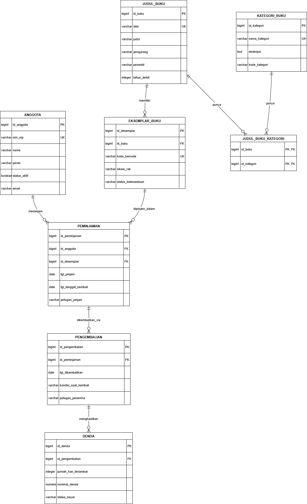

# LAPORAN

## Manajemen Sistem Basis Data — Kelompok 1

---

## 1. Nama Domain dan Alasan Kelompok Memilih Domain

### Nama Domain

**Sistem Peminjaman Buku Perpustakaan Kampus**

### Alasan Memilih Domain

Kelompok memilih domain sistem peminjaman buku perpustakaan kampus karena proses peminjaman dan pengembalian buku memiliki kebutuhan pengelolaan data yang cukup kompleks dan relevan untuk diterapkan dalam sistem basis data relasional.

Sistem perlu mengelola data anggota, judul buku, eksemplar buku fisik, kategori buku, transaksi peminjaman, pengembalian, serta denda. Domain ini juga memiliki beberapa aturan bisnis yang dapat digunakan untuk menerapkan konsep basis data seperti primary key, foreign key, unique constraint, relasi one-to-many, many-to-many, serta pengelolaan transaksi.

---

## 2. Ringkasan Lingkup Sistem

Sistem digunakan untuk mengelola operasional peminjaman dan pengembalian buku fisik di perpustakaan kampus.

### Lingkup Sistem

- Pengelolaan data anggota perpustakaan.
- Pengelolaan katalog judul buku.
- Pengelolaan setiap eksemplar atau salinan fisik buku.
- Pengelolaan kategori buku.
- Pencatatan transaksi peminjaman buku.
- Pencatatan transaksi pengembalian buku.
- Perhitungan dan pencatatan denda keterlambatan, kerusakan, atau kehilangan buku.
- Perpanjangan masa peminjaman.
- Pencatatan riwayat perbaikan eksemplar buku.

### Di Luar Lingkup Sistem

- Pengelolaan master mahasiswa dan dosen secara langsung karena data anggota berasal dari sistem akademik.
- Pengadaan atau pembelian buku.
- Pengelolaan transaksi keuangan atau payment gateway.
- Peminjaman ruang baca atau fasilitas perpustakaan lainnya.

---

## 3. Ringkasan Kebutuhan Data yang Dibuat

### KD-01 — Registrasi dan Sinkronisasi Anggota

Data yang disimpan:

- `id_anggota`
- `nim_nip`
- `nama`
- `peran`
- `status_aktif`
- `email`

Aturan bisnis:

- Data anggota berasal dari sistem informasi akademik.
- Hanya anggota dengan status aktif yang dapat melakukan peminjaman.

Estimasi volume sekitar 10.000 anggota dengan sinkronisasi harian.

### KD-02 — Pengelolaan Katalog Buku

Data yang disimpan:

- `id_buku`
- `isbn`
- `judul`
- `pengarang`
- `penerbit`
- `tahun_terbit`

Aturan bisnis:

- ISBN harus unik.
- Setiap judul buku harus memiliki minimal satu kategori.

Estimasi volume sekitar 5.000 judul buku.

### KD-03 — Pengelolaan Eksemplar Buku Fisik

Data yang disimpan:

- `id_eksemplar`
- `id_buku`
- `kode_barcode`
- `lokasi_rak`
- `status_ketersediaan`

Status eksemplar meliputi:

- `tersedia`
- `dipinjam`
- `rusak`
- `hilang`

Aturan bisnis:

- Barcode harus unik.
- Buku yang sedang dipinjam, rusak, atau hilang tidak dapat dipinjam kembali.

Estimasi volume sekitar 15.000 eksemplar.

### KD-04 — Peminjaman Eksemplar Buku

Data yang disimpan:

- `id_peminjaman`
- `id_anggota`
- `id_eksemplar`
- `tgl_pinjam`
- `tgl_tenggat_kembali`
- `petugas_pinjam`

Aturan bisnis:

- Anggota tidak dapat meminjam jika masih memiliki denda yang belum lunas.
- Mahasiswa maksimal meminjam 3 buku.
- Dosen maksimal meminjam 5 buku.
- Status eksemplar berubah menjadi `dipinjam` ketika dilakukan peminjaman.

### KD-05 — Pengembalian Buku

Data yang disimpan:

- `id_pengembalian`
- `id_peminjaman`
- `tgl_dikembalikan`
- `kondisi_saat_kembali`
- `petugas_penerima`

Aturan bisnis:

- Hanya peminjaman yang masih aktif yang dapat dikembalikan.
- Pengembalian terlambat menghasilkan denda.
- Status eksemplar diperbarui berdasarkan kondisi buku saat dikembalikan.

### KD-06 — Perhitungan Denda Keterlambatan dan Kerusakan

Data yang disimpan:

- `id_denda`
- `id_pengembalian`
- `jumlah_hari_terlambat`
- `nominal_denda`
- `status_bayar`

Aturan bisnis:

- Denda keterlambatan dihitung berdasarkan jumlah hari keterlambatan.
- Contoh tarif keterlambatan adalah Rp2.000 per hari.
- Kerusakan atau kehilangan dapat dikenakan biaya penggantian.
- Anggota yang memiliki denda belum lunas tidak dapat melakukan peminjaman baru.

### KD-07 — Perpanjangan Masa Pinjam Buku

Data yang disimpan:

- `id_perpanjangan`
- `id_peminjaman`
- `tgl_perpanjangan`
- `tgl_tenggat_baru`

Aturan bisnis:

- Satu peminjaman hanya dapat diperpanjang maksimal satu kali.
- Perpanjangan hanya dapat dilakukan jika buku belum dipesan anggota lain.
- Peminjaman yang sudah terlambat tidak dapat diperpanjang.

Kebutuhan ini bersifat **opsional**.

### KD-08 — Pencatatan Riwayat Perbaikan Eksemplar

Data yang disimpan:

- `id_perbaikan`
- `id_eksemplar`
- `tgl_mulai_perbaikan`
- `tgl_selesai_perbaikan`
- `rincian_perbaikan`

Aturan bisnis:

- Eksemplar yang sedang diperbaiki tidak dapat dipinjam.
- Eksemplar yang masuk proses perbaikan tidak ditampilkan sebagai buku yang siap dipinjam.

Kebutuhan ini bersifat **opsional**.

---

## 4. Penjelasan Singkat ERD

<p align="center">
  
</p>

ERD sistem **Peminjaman Buku Perpustakaan Kampus** terdiri dari beberapa entitas yang saling berhubungan untuk mendukung proses pengelolaan katalog, eksemplar buku, peminjaman, pengembalian, dan denda.

### Entitas pada ERD

#### 1. ANGGOTA

Tabel `anggota` menyimpan data pengguna perpustakaan, yaitu:

- `id_anggota` sebagai Primary Key.
- `nim_nip` sebagai Unique Key.
- `nama`
- `peran`
- `status_aktif`
- `email`

Satu anggota dapat melakukan banyak transaksi peminjaman.

#### 2. JUDUL_BUKU

Tabel `judul_buku` menyimpan informasi umum mengenai suatu judul buku, yaitu:

- `id_buku` sebagai Primary Key.
- `isbn` sebagai Unique Key.
- `judul`
- `pengarang`
- `penerbit`
- `tahun_terbit`

Satu judul buku dapat memiliki banyak eksemplar fisik.

#### 3. EKSEMPLAR_BUKU

Tabel `eksemplar_buku` menyimpan informasi mengenai setiap salinan fisik dari sebuah judul buku, yaitu:

- `id_eksemplar` sebagai Primary Key.
- `id_buku` sebagai Foreign Key.
- `kode_barcode` sebagai Unique Key.
- `lokasi_rak`
- `status_ketersediaan`

Hubungan antara `judul_buku` dan `eksemplar_buku` adalah **one-to-many**, karena satu judul buku dapat memiliki banyak eksemplar fisik.

#### 4. KATEGORI_BUKU

Tabel `kategori_buku` menyimpan informasi kategori buku, yaitu:

- `id_kategori` sebagai Primary Key.
- `nama_kategori` sebagai Unique Key.
- `deskripsi`
- `kode_kategori`

#### 5. JUDUL_BUKU_KATEGORI

Tabel `judul_buku_kategori` merupakan tabel penghubung antara `judul_buku` dan `kategori_buku`.

Kolomnya terdiri dari:

- `id_buku` sebagai Primary Key sekaligus Foreign Key.
- `id_kategori` sebagai Primary Key sekaligus Foreign Key.

Tabel ini digunakan untuk membentuk hubungan **many-to-many**, karena:

- Satu judul buku dapat memiliki beberapa kategori.
- Satu kategori dapat digunakan oleh beberapa judul buku.

#### 6. PEMINJAMAN

Tabel `peminjaman` mencatat transaksi peminjaman buku, yaitu:

- `id_peminjaman` sebagai Primary Key.
- `id_anggota` sebagai Foreign Key.
- `id_eksemplar` sebagai Foreign Key.
- `tgl_pinjam`
- `tgl_tenggat_kembali`
- `petugas_pinjam`

Tabel ini menghubungkan anggota dengan eksemplar buku yang dipinjam.

Satu anggota dapat memiliki banyak transaksi peminjaman, sedangkan satu eksemplar dapat muncul dalam beberapa riwayat transaksi peminjaman pada waktu yang berbeda.

#### 7. PENGEMBALIAN

Tabel `pengembalian` mencatat proses pengembalian dari transaksi peminjaman.

Kolom yang digunakan:

- `id_pengembalian` sebagai Primary Key.
- `id_peminjaman` sebagai Foreign Key.
- `tgl_dikembalikan`
- `kondisi_saat_kembali`
- `petugas_penerima`

Pengembalian memiliki hubungan dengan transaksi peminjaman dan digunakan untuk mengetahui kondisi buku saat dikembalikan.

#### 8. DENDA

Tabel `denda` mencatat denda yang dihasilkan dari proses pengembalian.

Kolom yang digunakan:

- `id_denda` sebagai Primary Key.
- `id_pengembalian` sebagai Foreign Key.
- `jumlah_hari_terlambat`
- `nominal_denda`
- `status_bayar`

Denda berhubungan dengan pengembalian karena denda dapat muncul akibat keterlambatan, kerusakan, atau kehilangan buku.

### Ringkasan Hubungan Antarentitas

| Relasi                          | Keterangan                                        |
| ------------------------------- | ------------------------------------------------- |
| `ANGGOTA` → `PEMINJAMAN`        | Satu anggota dapat melakukan banyak peminjaman    |
| `JUDUL_BUKU` → `EKSEMPLAR_BUKU` | Satu judul dapat memiliki banyak eksemplar        |
| `JUDUL_BUKU` ↔ `KATEGORI_BUKU`  | Relasi many-to-many melalui `JUDUL_BUKU_KATEGORI` |
| `ANGGOTA` → `PEMINJAMAN`        | Peminjaman dilakukan oleh anggota                 |
| `EKSEMPLAR_BUKU` → `PEMINJAMAN` | Peminjaman dilakukan terhadap eksemplar tertentu  |
| `PEMINJAMAN` → `PENGEMBALIAN`   | Transaksi peminjaman dapat dikembalikan           |
| `PENGEMBALIAN` → `DENDA`        | Pengembalian dapat menghasilkan denda             |

Struktur tersebut memisahkan **informasi judul buku** dengan **informasi eksemplar fisik**. Dengan demikian, satu judul dapat memiliki beberapa buku fisik dengan barcode dan status ketersediaan yang berbeda.

---

## 5. Keluaran atau Ringkasan Status Migration

Migration digunakan untuk membangun struktur database secara terkontrol menggunakan Flyway.

Hasil proses migration:

```text
Successfully validated 1 migration
Current version of schema "public": 1
Schema "public" is up to date. No migration necessary.
```

Hal tersebut menunjukkan bahwa migration berhasil divalidasi dan database sudah berada pada versi migration terbaru.

Database yang digunakan:

```text
proyek_dev
```

DBMS:

```text
PostgreSQL 17
```

Migration tool:

```text
Flyway 11
```

---

## 6. Bukti Database Dapat Dibangun Ulang Menggunakan Migration

<p align="center">
  
</p>

Flyway digunakan agar struktur database dapat dibangun secara konsisten berdasarkan file migration.

Perintah yang digunakan:

```powershell
docker compose run --rm flyway migrate
```

Hasil:

```text
Successfully validated 1 migration
Current version of schema "public": 1
Schema "public" is up to date. No migration necessary.
```

Untuk memastikan koneksi Flyway ke PostgreSQL berhasil, digunakan:

```powershell
docker compose run --rm flyway testConnection
```

Hasil:

```text
Database: jdbc:postgresql://postgres:5432/proyek_dev
PostgreSQL 17.11
Flyway engine connection successful
```

Hasil tersebut membuktikan bahwa Flyway dapat terhubung ke database `proyek_dev` dan menjalankan proses migration.

---

## 7. Bukti Pola Tiga Langkah Penambahan Kolom NOT NULL

<p align="center">
  
</p>

Penambahan kolom `NOT NULL` dilakukan menggunakan pola tiga langkah agar tidak menyebabkan kegagalan ketika tabel sudah memiliki data.

### Langkah 1 — Menambahkan Kolom Tanpa NOT NULL

```sql
ALTER TABLE peminjaman
ADD COLUMN catatan TEXT;
```

Kolom ditambahkan terlebih dahulu tanpa constraint `NOT NULL`, sehingga data lama tetap dapat dipertahankan.

### Langkah 2 — Mengisi Data yang Masih NULL

```sql
UPDATE peminjaman
SET catatan = 'Tidak ada catatan'
WHERE catatan IS NULL;
```

Semua baris yang memiliki nilai `NULL` diberikan nilai awal.

### Langkah 3 — Menambahkan Constraint NOT NULL

```sql
ALTER TABLE peminjaman
ALTER COLUMN catatan SET NOT NULL;
```

Setelah seluruh data memiliki nilai, kolom dapat diubah menjadi `NOT NULL`.

Pola tersebut lebih aman dibandingkan langsung membuat kolom baru dengan `NOT NULL` pada tabel yang sudah memiliki data.

---

## 8. Hasil Seed Data Setelah Dijalankan Dua Kali

Seed digunakan untuk memasukkan data awal ke dalam database.

File seed:

```text
latihan/p02/seeds/01_peran.sql
```

Perintah yang digunakan:

```powershell
Get-Content .\latihan\p02\seeds\01_peran.sql | docker compose exec -T postgres psql -U msbd -d proyek_dev
```

Seed dijalankan sebanyak dua kali untuk menguji bahwa data awal dapat dimasukkan kembali tanpa menghasilkan duplikasi.

Data yang digunakan:

| Kode | Nama          |
| ---- | ------------- |
| ADM  | Administrator |
| PTG  | Petugas       |
| AGT  | Anggota       |

Pengecekan jumlah data:

```powershell
docker compose exec postgres psql -U msbd -d proyek_dev -c "SELECT count(*) FROM peran;"
```

Hasil:

```text
count
-------
3
```

Hasil tersebut menunjukkan bahwa setelah seed dijalankan dua kali, jumlah data tetap **3**, sehingga mekanisme `ON CONFLICT` berhasil mencegah duplikasi.

---

## 9. Pengamatan dari pg_stat_activity

Pengamatan dilakukan menggunakan view PostgreSQL:

```sql
SELECT
    pid,
    usename,
    datname,
    state,
    wait_event_type,
    wait_event,
    query
FROM pg_stat_activity;
```

Pada percobaan, Terminal 1 menjalankan transaksi:

```sql
BEGIN;

SELECT count(*)
FROM peminjaman;
```

Transaksi kemudian dibiarkan terbuka sehingga statusnya terlihat sebagai:

```text
idle in transaction
```

Sementara itu, Terminal 2 menjalankan:

```sql
ALTER TABLE peminjaman
ADD COLUMN catatan TEXT;
```

Perintah `ALTER TABLE` terlihat dalam kondisi menunggu lock dengan `wait_event_type`:

```text
Lock
```

Hal tersebut terjadi karena transaksi pada Terminal 1 masih memegang lock terhadap tabel `peminjaman`, sedangkan `ALTER TABLE` membutuhkan lock yang lebih kuat.

Kondisi seperti ini dapat menyebabkan antrean query dan penurunan performa apabila terjadi pada sistem produksi. Transaksi yang dibiarkan terbuka terlalu lama juga dapat menyebabkan query lain menunggu dan berpotensi menghabiskan koneksi database.

---

## 10. Jawaban Pertanyaan 1–7

### Pertanyaan 1

Basis data pengujian harus dipisah secara total agar proses testing tidak merusak data development. Selain itu, pemisahan ini mencegah konflik konfigurasi tingkat global yang rentan terjadi jika hanya mengandalkan schema yang berbeda.

### Pertanyaan 2

Saya memilih **KD-04 Peminjaman Eksemplar Buku** karena memiliki aturan bisnis bahwa anggota tidak dapat melakukan peminjaman jika masih memiliki denda yang belum lunas atau sudah mencapai batas jumlah peminjaman aktif.

Batas peminjaman adalah:

- Mahasiswa maksimal 3 buku.
- Dosen maksimal 5 buku.

Mekanisme yang dipilih adalah **Application Logic**.

Alasannya, aturan tersebut membutuhkan evaluasi dari beberapa tabel, seperti menghitung jumlah peminjaman aktif pada tabel `peminjaman` dan memeriksa status pembayaran pada tabel `denda`. CHECK constraint tidak dapat digunakan untuk melakukan pemeriksaan seperti ini secara langsung.

Application logic juga lebih fleksibel karena dapat memberikan respons yang spesifik kepada pengguna ketika peminjaman ditolak. Penggunaan trigger memang memungkinkan, tetapi dapat membuat logika database menjadi lebih kaku dan sulit dipelihara.

### Pertanyaan 3

Program menerapkan konsep tersebut pada hubungan **Peminjaman dan Eksemplar Buku**.

Pada ERD, tabel `peminjaman` secara langsung memiliki `id_eksemplar`, sehingga satu baris peminjaman merepresentasikan satu eksemplar buku.

Jika menggunakan konsep **Baris Pinjam**, satu transaksi peminjaman dapat memiliki beberapa buku dan setiap buku dicatat pada tabel `baris_pinjam`.

Struktur yang digunakan saat ini membuat satu transaksi peminjaman hanya merepresentasikan satu eksemplar pada satu baris. Konsekuensinya, jika seorang anggota meminjam beberapa buku sekaligus, setiap buku perlu memiliki baris transaksi peminjaman sendiri.

### Pertanyaan 4

Program menerapkan konsep tersebut pada **Judul Buku dan Eksemplar Buku**.

`Judul Buku` menyimpan informasi umum seperti:

- ISBN
- Judul
- Pengarang
- Penerbit

Sedangkan `Eksemplar Buku` menyimpan informasi masing-masing buku fisik seperti:

- Kode barcode
- Lokasi rak
- Status ketersediaan

Pemisahan tersebut diperlukan karena satu judul buku dapat memiliki banyak eksemplar fisik dengan kondisi atau status yang berbeda.

Contoh pertanyaan bisnis yang dapat dijawab:

> "Berapa jumlah buku dari judul tertentu yang tersedia, sedang dipinjam, rusak, atau hilang?"

Dengan memisahkan judul dan eksemplar, informasi tersebut dapat dikelola dengan lebih akurat.

### Pertanyaan 5

Jika file `V1__skema_awal.sql` yang sudah pernah dijalankan diubah, kemudian anggota kelompok lain melakukan `flyway migrate`, Flyway dapat menghasilkan **checksum mismatch validation error**.

Hal tersebut terjadi karena Flyway menyimpan checksum dari migration yang telah dijalankan pada tabel:

```text
flyway_schema_history
```

Ketika isi file V1 berubah, checksum file tidak lagi sama dengan checksum yang tersimpan di database.

Cara yang benar tanpa menghapus history adalah mengembalikan V1 ke kondisi awal dan membuat migration baru, misalnya:

```text
latihan/p02/migrations/V2__penyesuaian_skema.sql
```

Kemudian menjalankan:

```powershell
docker compose run --rm flyway migrate
```

Dengan cara tersebut, migration lama tetap menjadi bagian dari history dan perubahan baru dicatat sebagai migration berikutnya.

### Pertanyaan 6

Pada pengamatan menggunakan `pg_stat_activity`, Terminal 1 berada dalam kondisi:

```text
idle in transaction
```

setelah menjalankan:

```sql
BEGIN;

SELECT count(*)
FROM peminjaman;
```

Transaksi tersebut belum melakukan `COMMIT`.

Kemudian Terminal 2 menjalankan:

```sql
ALTER TABLE peminjaman
ADD COLUMN catatan TEXT;
```

Perintah tersebut berada pada kondisi menunggu dengan:

```text
wait_event_type = Lock
```

Hal ini terjadi karena transaksi pada Terminal 1 masih memegang lock pada tabel `peminjaman`, sedangkan `ALTER TABLE` membutuhkan lock yang lebih kuat.

Pada sistem produksi, transaksi yang terlalu lama terbuka dapat menyebabkan query lain ikut menunggu. Kondisi tersebut dapat menyebabkan antrean lock, peningkatan penggunaan koneksi database, dan penurunan performa sistem.

### Pertanyaan 7

Seed tidak dimasukkan ke dalam migration karena keduanya memiliki tujuan yang berbeda.

Migration digunakan untuk mengelola **perubahan struktur database**, seperti membuat tabel, menambahkan kolom, atau membuat constraint. Migration memiliki history yang terkontrol dan sebaiknya tidak diubah setelah diterapkan.

Sedangkan seed digunakan untuk memasukkan **data awal atau data contoh** ke dalam database.

Dengan memisahkan migration dan seed, struktur database dapat dikelola secara konsisten, sedangkan data awal dapat dimasukkan kembali sesuai kebutuhan tanpa mengubah history migration.

---

## 11. Daftar Kontribusi atau Commit Masing-Masing Anggota Kelompok

| No. | Nama | NIM | Kontribusi / Commit |
|:---:|---|:---:|---|
| 1 | Muhammad Lukman Toro | `251402105` | **Langkah 4** |
| 2 | Khairunnisa | `251402017` | — |
| 3 | Rumaisha Raghib Syahidah Siregar | `251402034` | **Langkah 2 MSBD** |
| 4 | Randi Abdiansyah | `251402138` | **Langkah 5** |
| 5 | Muhammad Ihsan Anwar | `251402044` | **Finishing Tugas** |

---
