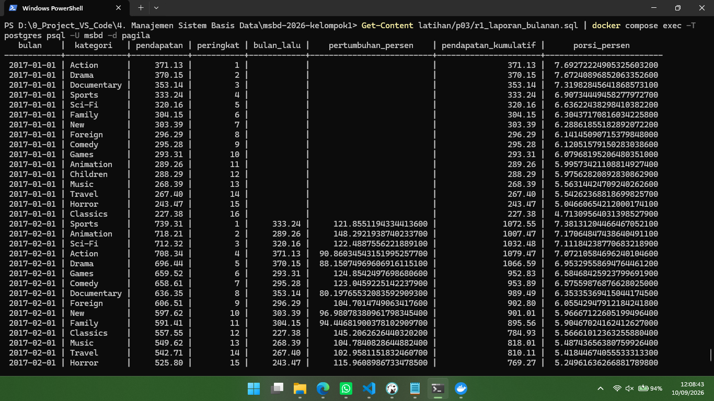

## Daftar Kelompok dan Kontribusi

|  No.   | Nama                                 |     NIM     | Posisi              | Kontribusi                  | Commit                                |
| :----: | :----------------------------------- | :---------: | :------------------ | :-------------------------- | :------------------------------------ |
| **01** | **Muhammad Lukman Toro**             | `251402105` | **Project Manager** | Langkah 2                   | **Langkah 2**                         |
| **02** | **Khairunnisa**                      | `251402017` | Anggota             | Langkah 5                   | **langkah 5**langkah 5 q10-q15**  |
| **03** | **Rumaisha Raghib Syahidah Siregar** | `251402034` | Anggota             | Langkah 4                   | **Langkah 4**, **perbaiki Langkah 4** |
| **04** | **Muhammad Ihsan Anwar**             | `251402044` | Anggota             | Langkah 7, 8, dan Finishing | **Langkah 7, 8, dan Finishing**       |
| **05** | **Randi Abdiansyah**                 | `251402138` | Anggota             | Langkah 3                   | **perbaikan langkah 3**               |

---

## Pertanyaan Reflektif

### Pertanyaan Reflektif A

**Pada Q4, apa tepatnya yang membuat `NOT IN` berbahaya, dan bagaimana memeriksa apakah sebuah kolom rawan terhadap masalah itu?**

> Kalau di dalam subquery ada satu aja nilai `NULL`, hasil `NOT IN` jadi kosong semua — padahal seharusnya ada hasil. Ini karena SQL gak bisa mastiin "beda dari NULL" itu true atau false, jadi baris itu ikut ke-skip semua.
>
> Cara cek: jalankan `SELECT COUNT(*) FROM inventory WHERE film_id IS NULL;` — kalau hasilnya 0, aman pakai `NOT IN`. Kalau ragu, langsung pakai `NOT EXISTS` aja, gak akan kena masalah ini.

**Pada Q5, berapa kali subquery dievaluasi secara konseptual, dan mengapa “sekali per baris luar” belum tentu sama dengan yang benar-benar dikerjakan mesin?**

> Secara teori: sekali per baris di query luar (karena subquery-nya butuh nilai `store_id` dari tiap baris).
>
> Tapi itu cuma cara mikir logisnya. Kenyataannya, PostgreSQL sering optimasi ulang di belakang layar (misal diubah jadi join biasa), jadi belum tentu benar-benar dieksekusi satu-satu sebanyak itu. Buat lihat yang beneran terjadi, tinggal jalankan `EXPLAIN ANALYZE` di depan query-nya.

### Pertanyaan Reflektif B

**Pada Q7, mengapa recursive term hanya melihat baris yang baru dihasilkan pada iterasi sebelumnya, dan apa akibatnya jika ia melihat seluruh hasil?**

> Mengapa recursive term hanya melihat baris yang baru dihasilkan pada iterasi sebelumnya, dan apa akibatnya jika ia melihat seluruh hasil?
>
> Penyebab: Eksekusi Recursive CTE menggunakan algoritma evaluasi iteratif (working table). Pada setiap iterasi, recursive term mengeksekusi join hanya terhadap baris intermediate yang dihasilkan pada iterasi tepat sebelum dirinya ($N-1$).
>
> Akibat jika melihat seluruh hasil: Jika recursive term melakukan join terhadap keseluruhan hasil akumulasi ($1$ sampai $N-1$), terjadi pencetakan ulang data yang sudah ada sebelumnya. Hal ini akan memicu infinite loop (pengulangan tanpa henti) dan ekponensial duplikasi baris data hingga memori database habis.

**Kapan mengganti `UNION ALL` dengan `UNION` dapat menghentikan siklus, dan mengapa itu tetap bukan solusi yang baik?**

> Kapan menghentikan siklus: `UNION` secara otomatis melakukan eliminasi duplikat pada seluruh baris hasil gabungan. Jika struktur siklus menghasilkan status baris (tuple) yang identik secara persis dengan iterasi sebelumnya, `UNION` akan membuang baris duplikat tersebut sehingga iterasi berhenti.
>
> Mengapa bukan solusi yang baik:
>
> - **Performa Lambat:** `UNION` memaksa basis data melakukan operasi pengurutan (sorting) atau hashing yang sangat berat pada setiap step iterasi untuk mencari duplikat.
> - **Gagal Mencegah Siklus yang Mengubah State:** Jika dalam recursive term terdapat kolom dinamis seperti level + 1 atau penambahan teks pada path, setiap siklus akan selalu menghasilkan baris baru yang unik (karena nilainya beda). Akibatnya `UNION` tidak akan mendeteksi duplikat tersebut dan query tetap mengalami infinite loop.
>
> Solusi Benar: Gunakan array penelusuran (`NOT id = ANY(path)`) atau klausa `CYCLE`.

---

### Pertanyaan Reflektif C

**Pada Q14, berapa tanggal yang berbeda, dan sifat data apa pada tabel `payment` yang menyebabkan perbedaan?**

> Perbedaan Q14 & Penyebabnya: (Sesuaikan jumlah tanggal yang muncul di output-mu). Perbedaan muncul akibat adanya celah hari tanpa transaksi (gap) pada tabel `payment`. Klausa `ROWS` menghitung jumlah baris secara kaku tanpa peduli jarak waktu, sedangkan `RANGE` menghitung berdasarkan rentang tanggal kalender riil.

**Jika Q13 menjadi laporan resmi keuangan, versi mana yang benar dan mengapa kesalahan frame sulit ditemukan melalui pengujian biasa?**

> Laporan Resmi Keuangan: Versi `RANGE` yang benar. Kesalahan pada `ROWS` sangat sulit dideteksi dalam pengujian biasa karena grafik angkanya sekilas tampak normal dan terus naik, padahal perhitungan akuntansi harian pada tanggal kosong menjadi tidak sinkron.

**Pada Q15, apa yang terjadi pada total belanja jika `ORDER BY` ditambahkan ke dalam `OVER` tanpa menuliskan frame?**

> Efek Q15 jika ditambah `ORDER BY`: Menambahkan `ORDER BY` ke dalam `SUM() OVER()` tanpa spesifikasi frame akan memicu default frame (`RANGE UNBOUNDED PRECEDING`). Akibatnya, kolom tidak lagi menampilkan total akhir, melainkan berubah menjadi running total (kumulatif naik bertahap) di tiap barisnya.

---

### Pertanyaan Reflektif D

**Pada Q16, tanpa `GROUPING()`, bagaimana pembaca membedakan subtotal dari baris data yang kolomnya memang kosong?**

> Tanpa fungsi `GROUPING()`, pembaca tidak dapat membedakan secara pasti antara baris data riil yang bernilai kosong dengan baris subtotal karena PostgreSQL sama-sama menampilkan nilai `NULL` untuk keduanya; satu-satunya cara pembaca menebaknya adalah dengan melihat pola konteks agregatnya (di mana baris subtotal biasanya memiliki nilai jumlah_film yang setara dengan penjumlahan baris-baris rating di atasnya pada kategori yang sama) atau mengurutkan data sedemikian rupa agar baris kalkulasi berada di akhir, namun cara ini sangat rentan keliru jika ada data asli yang memang bernilai `NULL`.

**Pada Q17, mengapa versi `FILTER` dan `CASE WHEN` dapat memberi rata-rata berbeda walaupun jumlah baris sama?**

> Perbedaan terjadi karena `FILTER` selalu mengecualikan baris yang tidak lolos dari pembagi rata-rata, sedangkan pada `CASE WHEN` hasil rata-rata sangat bergantung pada apakah kondisi gagal menghasilkan `NULL` (diabaikan) atau nilai default seperti `0` (ikut membagi).

---

### Pertanyaan Reflektif E

**Dari nomor transaksi, status, jumlah, dan identitas pelanggan di dalam payload, mana yang sebaiknya dipromosikan menjadi kolom relasional dengan constraint dan mana yang tepat tetap berada di JSON? Berikan alasan untuk setiap pilihan.**

> Nomor transaksi, status, jumlah, dan identitas pelanggan sebaiknya dipromosikan menjadi kolom relasional karena merupakan data inti yang membutuhkan konsistensi dan dapat diberi constraint seperti `PRIMARY KEY`, `CHECK`, dan `FOREIGN KEY`. Sementara itu, informasi tambahan yang sifatnya fleksibel atau dapat berubah strukturnya lebih tepat tetap disimpan dalam JSONB agar database tetap fleksibel tanpa menambah banyak kolom yang tidak selalu digunakan.

---

## Temuan Q14

```text
PS D:\0_Project_VS_Code\4. Manajemen Sistem Basis Data\msbd-2026-kelompok1> Get-Content latihan/p03/q14_rows_vs_range.sql | docker compose exec -T postgres psql -U msbd -d pagila
  tanggal   | kumulatif_rows | kumulatif_range |      rerata_rows      |     rerata_range
------------+----------------+-----------------+-----------------------+-----------------------
 2017-01-31 |        4824.43 |         4824.43 |  668.6828571428571429 |  603.0537500000000000
 2017-02-14 |        5115.65 |         5115.65 |  625.3485714285714286 |  568.4055555555555556
 2017-02-15 |        6492.19 |         6492.19 |  716.2328571428571429 |  649.2190000000000000
 2017-02-16 |        7817.00 |         7817.00 |  800.4685714285714286 |  710.6363636363636364
 2017-02-17 |        9233.60 |         9233.60 |  892.3928571428571429 |  769.4666666666666667
 2017-02-18 |       10666.26 |        10666.26 | 1003.4228571428571429 |  820.4815384615384615
 2017-02-19 |       12148.75 |        12148.75 | 1124.1528571428571429 |  867.7678571428571429
 2017-02-20 |       13574.35 |        13574.35 | 1249.9885714285714286 |  904.9566666666666667
 2017-02-21 |       14456.31 |        14456.31 | 1334.3800000000000000 |  903.5193750000000000
 2017-02-28 |       14840.40 |        14840.40 | 1192.6014285714285714 |  872.9647058823529412
 2017-03-01 |       17666.69 |        17666.69 | 1407.0985714285714286 |  981.4827777777777778
 2017-03-02 |       19814.60 |        19814.60 | 1511.5714285714285714 | 1042.8736842105263158
 2017-03-16 |       20380.27 |        20380.27 | 1387.7157142857142857 | 1019.0135000000000000
 2017-03-17 |       22907.18 |        22907.18 | 1536.9185714285714286 | 1090.8180952380952381
 2017-03-18 |       25582.95 |        25582.95 | 1715.5142857142857143 | 1162.8613636363636364
 2017-03-19 |       28177.82 |        28177.82 | 1960.2157142857142857 | 1225.1226086956521739
 2017-03-20 |       30902.52 |        30902.52 | 2294.5885714285714286 | 1287.6050000000000000
 2017-03-21 |       33747.91 |        33747.91 | 2297.3171428571428571 | 1349.9164000000000000
 2017-03-22 |       36315.65 |        36315.65 | 2357.2928571428571429 | 1396.7557692307692308
 2017-03-23 |       38342.87 |        38342.87 | 2566.0857142857142857 | 1420.1062962962962963
 2017-04-05 |       38839.67 |        38839.67 | 2276.0700000000000000 | 1387.1310714285714286
 2017-04-06 |       40854.92 |        40854.92 | 2181.7100000000000000 | 1408.7903448275862069
 2017-04-07 |       42901.07 |        42901.07 | 2103.3214285714285714 | 1430.0356666666666667
 2017-04-08 |       45123.95 |        45123.95 | 2031.6328571428571429 | 1455.6112903225806452
 2017-04-09 |       47276.64 |        47276.64 | 1932.6757142857142857 | 1477.3950000000000000
 2017-04-10 |       49152.91 |        49152.91 | 1833.8942857142857143 | 1489.4821212121212121
 2017-04-11 |       51136.27 |        51136.27 | 1827.6285714285714286 | 1504.0079411764705882
 2017-04-12 |       52817.33 |        52817.33 | 1996.8085714285714286 | 1509.0665714285714286
 2017-04-26 |       53526.73 |        53526.73 | 1810.2585714285714286 | 1486.8536111111111111
 2017-04-27 |       56098.44 |        56098.44 | 1885.3385714285714286 | 1516.1740540540540541
 2017-04-28 |       58733.20 |        58733.20 | 1944.1785714285714286 | 1545.6105263157894737
 2017-04-29 |       61851.86 |        61851.86 | 2082.1742857142857143 | 1585.9451282051282051
 2017-04-30 |       66902.33 |        66902.33 | 2535.6314285714285714 | 1672.5582500000000000
 2017-05-14 |       67416.51 |        67416.51 | 2325.7485714285714286 | 1644.3051219512195122
```

**Temuan Q14:** Terdapat 35 tanggal yang memiliki hasil berbeda antara frame `ROWS` dan `RANGE`, yaitu pada kolom `rerata`. `ROWS` menghitung rata-rata berdasarkan maksimal 7 baris/tanggal terakhir, sedangkan `RANGE` tanpa klausa frame menggunakan rentang dari awal data hingga tanggal saat ini. Sementara itu, nilai kumulatif pada kedua frame tetap sama karena keduanya melakukan penjumlahan kumulatif dari awal data hingga baris saat ini.

---

## Hasil R1

<p align="center">
  
</p>

---

## Centang Ringkasan Hasil Akhir

- [x] PostgreSQL 17 dan Pagila berhasil diverifikasi.
- [x] `q00_setup.sql` dapat dijalankan ulang tanpa galat.
- [x] Q1–Q20 lengkap dan setiap berkas memiliki tiga komentar pembuka.
- [x] Data Q9 sudah dipulihkan setelah uji siklus.
- [x] Jawaban reflektif A–E ditulis dengan kalimat kelompok sendiri.
- [x] Temuan Q14 dicatat dan dijelaskan.
- [x] R1 memuat enam keluaran yang diminta dan memakai partisi/frame yang tepat.
- [x] Tangkapan layar sepuluh baris pertama R1 tersedia.
- [x] `laporan.md` dan `README.md` lengkap.
- [x] Seluruh hasil berada di `latihan/p03/` dan tidak tercampur dengan folder proyek.
- [x] Setiap anggota mempunyai kontribusi commit yang dapat ditelusuri.
- [x] Merge request sudah dibuka dan tautannya dicantumkan.
